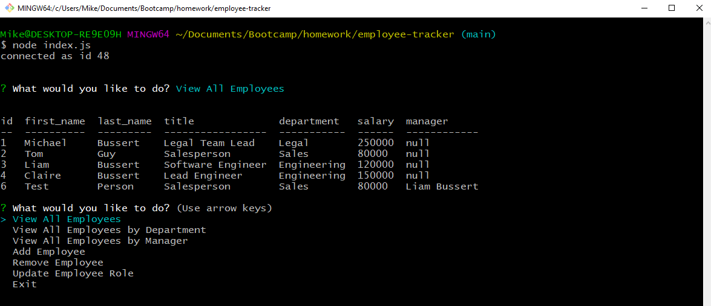
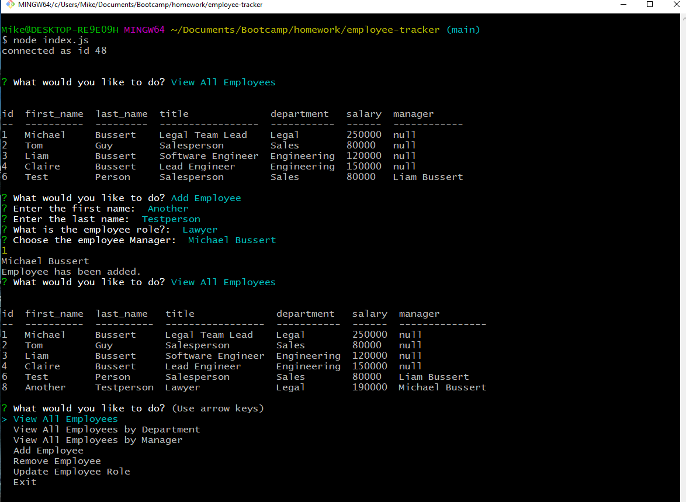

# CLI Employee Content Management System

  ## Links:  

  YouTube Demo:   https://youtu.be/lyzSifQeLVI  
  Repository: https://github.com/mbussert/employee-tracker

  ## Description: 

  A CMS for managing a company's employees using Node, Inquirer, and MySQL.  

   

  ## Table of Contents: 

  * [Installation](#installation)
  * [Usage](#usage)
  * [License](#license)
  * [Contributing](#contributing)
  * [Testing](#tests)
  * [Contact](#contact)

  ## Installation: 

  This application requires the user to install a few different dependencies via 'npm install' before using.

  ## Usage: 

  A user run's the command 'node index.js' and uses the command-line interface (and arrow keys) to view and modify any and all employees of their company.  

    

  

  ## License: 

  This application is covered under the GNU GPLv3 license.

  ## Contributing: 

  Users are free to contribute to this project.

  ## Tests: 

  No tests have been created for this application.  

  ## Questions: 

  GitHub: [mbussert](https://github.com/mbussert)  
  By Email: [mbussert@gmail.com](mailto:mbussert@gmail.com)
